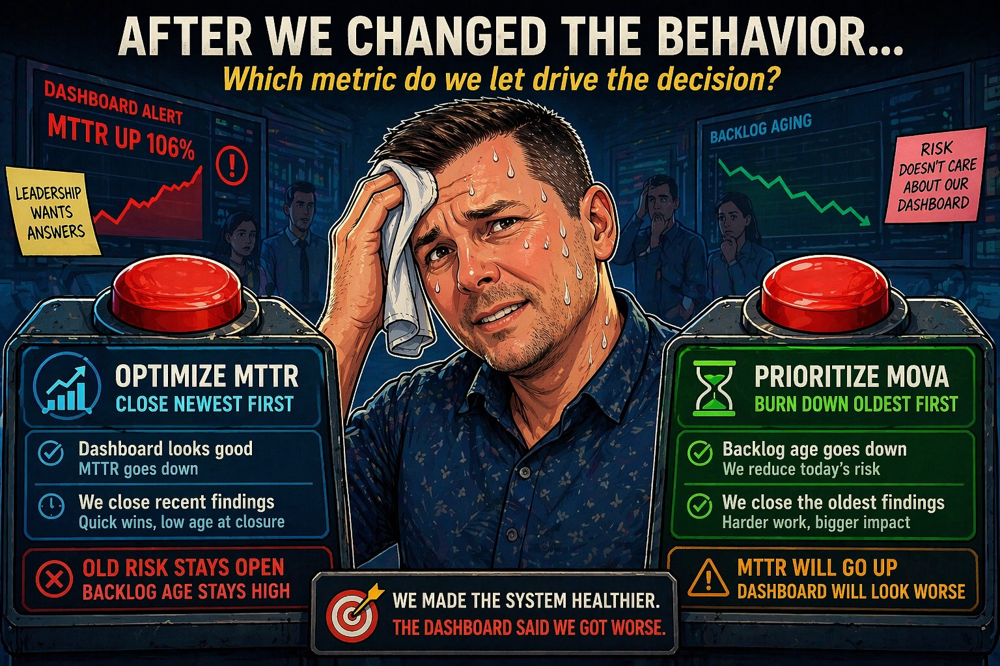

```{python}
#| echo: false
import polars as pl
from great_tables import GT, loc, style
from plotnine import (
    aes,
    element_blank,
    element_line,
    element_rect,
    element_text,
    geom_line,
    geom_point,
    geom_text,
    ggplot,
    labs,
    scale_color_manual,
    scale_x_continuous,
    scale_y_continuous,
    theme,
    theme_minimal,
)

STRATEGY_LABELS = {
    "oldest_first": "Oldest-First",
    "newest_first": "Newest-First",
}


def add_strategy_label(dataframe):
    return dataframe.with_columns(
        pl.col("strategy").replace(STRATEGY_LABELS).alias("strategy_label")
    )


metrics = add_strategy_label(pl.read_parquet("data/metrics.parquet"))
summary = add_strategy_label(pl.read_parquet("data/summary.parquet"))

STRATEGY_COLORS = {
    "Oldest-First": "#1F6F78",
    "Newest-First": "#8B1E3F",
}
STRATEGY_ORDER = ["Oldest-First", "Newest-First"]
MONTH_BREAKS = [1, 6, 12, 18, 24]
LAST_MONTH = metrics.get_column("month_index").max()
if LAST_MONTH is None:
    raise ValueError("data/metrics.parquet does not contain any month_index values.")
ROOM_BG = "#f3ebde"
PANEL_BG = "#fffdf8"
GRID_COLOR = "#c8baa5"
LINE_SIZE = 2.8
ENDPOINT_SIZE = 5.0
ENDPOINT_LABEL_SIZE = 8
ENDPOINT_LABEL_X_NUDGE = 0.55
COMPARISON_ALPHA = 0.75
X_AXIS_EXPAND = (0.01, 0.85)
DEFAULT_Y_EXPAND = (0.02, 0)
TAIL_Y_EXPAND = (0.02, 12)
chart_theme = theme_minimal(base_size=22) + theme(
    figure_size=(11.35, 5.35),
    legend_position="top",
    legend_title=element_blank(),
    legend_text=element_text(color="#26333A", size=15),
    legend_background=element_blank(),
    legend_key=element_blank(),
    panel_grid_minor=element_blank(),
    panel_grid_major_x=element_blank(),
    panel_grid_major_y=element_line(color=GRID_COLOR, size=0.7),
    panel_background=element_rect(fill=PANEL_BG, color=None),
    plot_background=element_rect(fill=ROOM_BG, color=None),
    axis_title=element_text(color="#26333A", size=18),
    axis_text=element_text(color="#26333A", size=15),
    axis_text_x=element_text(margin={"t": 8}),
    axis_text_y=element_text(margin={"r": 8}),
    plot_title=element_text(weight="bold", color="#101828", size=22),
    plot_subtitle=element_text(color="#55606B", size=14, margin={"b": 10}),
    axis_title_x=element_text(margin={"t": 16}),
    axis_title_y=element_text(margin={"r": 18}),
)


def strategy_line_plot(
    dataframe,
    y_col,
    title,
    subtitle,
    y_axis_label,
    highlighted_strategy,
    y_expand=DEFAULT_Y_EXPAND,
    y_limits=None,
):
    is_highlighted = pl.col("strategy_label") == highlighted_strategy
    is_endpoint = pl.col("month_index") == LAST_MONTH
    highlighted = dataframe.filter(is_highlighted)
    comparison = dataframe.filter(~is_highlighted)
    highlighted_endpoints = highlighted.filter(is_endpoint)
    comparison_endpoints = comparison.filter(is_endpoint)
    y_min = dataframe.select(pl.col(y_col).min()).item()
    y_max = dataframe.select(pl.col(y_col).max()).item()
    if y_min is None or y_max is None:
        raise ValueError(f"{y_col} does not contain any values to plot.")

    label_floor_offset = max(3.0, (y_max - y_min) * 0.03)
    endpoint_labels = dataframe.filter(is_endpoint).with_columns(
        (pl.col("month_index") + ENDPOINT_LABEL_X_NUDGE).alias("label_month"),
        pl.col(y_col).round(0).cast(pl.Int64).cast(pl.String).alias("endpoint_label"),
        (
            pl.when(pl.col(y_col) <= label_floor_offset)
            .then(pl.col(y_col) + label_floor_offset)
            .otherwise(pl.col(y_col))
        ).alias("label_value"),
    )
    highlighted_labels = endpoint_labels.filter(is_highlighted)
    comparison_labels = endpoint_labels.filter(~is_highlighted)

    return (
        ggplot(mapping=aes(x="month_index", y=y_col, color="strategy_label"))
        + geom_line(data=comparison, size=LINE_SIZE, alpha=COMPARISON_ALPHA)
        + geom_line(data=highlighted, size=LINE_SIZE)
        + geom_point(
            data=comparison_endpoints,
            size=ENDPOINT_SIZE,
            alpha=COMPARISON_ALPHA,
        )
        + geom_point(data=highlighted_endpoints, size=ENDPOINT_SIZE)
        + geom_text(
            data=comparison_labels,
            mapping=aes(
                x="label_month",
                y="label_value",
                label="endpoint_label",
            ),
            size=ENDPOINT_LABEL_SIZE,
            ha="left",
            va="center",
            alpha=COMPARISON_ALPHA,
            show_legend=False,
        )
        + geom_text(
            data=highlighted_labels,
            mapping=aes(
                x="label_month",
                y="label_value",
                label="endpoint_label",
            ),
            size=ENDPOINT_LABEL_SIZE,
            ha="left",
            va="center",
            show_legend=False,
        )
        + scale_color_manual(values=STRATEGY_COLORS, breaks=STRATEGY_ORDER)
        + scale_x_continuous(breaks=MONTH_BREAKS, expand=X_AXIS_EXPAND)
        + scale_y_continuous(expand=y_expand, limits=y_limits)
        + labs(
            title=title,
            subtitle=subtitle,
            x="Month",
            y=y_axis_label,
        )
        + chart_theme
    )


card_lookup = {
    row["strategy_label"]: row
    for row in summary.select(
        "strategy_label",
        pl.col("mttr_days").round(1).alias("mttr_days"),
        pl.col("mova_days").round(1).alias("mova_days"),
        "open_count",
        "aged_over_180",
    ).to_dicts()
}


def get_strategy_card(strategy_label):
    card = card_lookup.get(strategy_label)
    if card is None:
        available_labels = ", ".join(sorted(card_lookup)) or "none"
        raise ValueError(
            "data/summary.parquet is missing required strategy_label "
            f"{strategy_label!r}. Available labels: {available_labels}."
        )
    return card


oldest_card = get_strategy_card("Oldest-First")
newest_card = get_strategy_card("Newest-First")

oldest_mttr = f"{oldest_card['mttr_days']:.1f}"
oldest_mova = f"{oldest_card['mova_days']:.1f}"
oldest_open = int(oldest_card["open_count"])
oldest_tail = int(oldest_card["aged_over_180"])

newest_mttr = f"{newest_card['mttr_days']:.1f}"
newest_mova = f"{newest_card['mova_days']:.1f}"
newest_open = int(newest_card["open_count"])
newest_tail = int(newest_card["aged_over_180"])
```

## {#opening .hero-slide}

::: {.hero-block}
::: {.hero-eyebrow}
Security Metrics / BSides Charm
:::

<div class="hero-title">Why Vulnerability<br>MTTR Alone<br>Misleads</div>
<div class="hero-subtitle">Add MOVA to Measure Real Risk</div>
<div class="hero-divider" aria-hidden="true"></div>
<div class="hero-author">Caleb Kinney</div>
:::

---

## MTTR just doubled {.center .hook-slide}

:::: {.shock-card}
::: {.shock-label}
Mean time to remediate
:::

:::: {.shock-row}
::: {.shock-panel}
::: {.shock-caption}
Last month
:::
::: {.shock-value}
15d
:::
:::

::: {.shock-arrow}
→
:::

::: {.shock-panel .danger}
::: {.shock-caption}
This month
:::
::: {.shock-value}
31d
:::
:::
::::

::: {.shock-subtitle}
Dashboards call this failure.
The better question is: what actually changed?

What happened to backlog age?
What happened to the oldest findings?
:::
::::

---

## This actually happened {.top-loaded}

::: {.line-anchor}
In a vulnerability management program, MTTR increased after we made it a KPI.
:::

::: {.incremental}
- We made MTTR visible
- Teams were doing better, including the older findings
- The metric got worse
:::

. . .

::: {.line-anchor .centered}
The review question was: “Why are we getting worse?”
:::

::: {.kicker}
That was a fun meeting.
:::

::: {.line-anchor .line-anchor-subtle .centered}
MTTR rose because we finally closed the oldest findings.
:::

---

## Paradox {.center .statement-slide}

::: {.metric-big .centered}
The MTTR Paradox
:::

::: {.paradox-cue}
::: {.paradox-pill}
<span class="paradox-name">MTTR</span>
<span class="paradox-trend">↑</span>
:::
::: {.paradox-connector}
while
:::
::: {.paradox-pill}
<span class="paradox-name">MOVA</span>
<span class="paradox-trend paradox-trend-down">↓</span>
:::
:::

::: {.line-anchor .line-anchor-subtle .centered}
MTTR can rise while backlog age falls.
:::

---

## Flow vs. backlog age

::: {.definition-grid}
::: {.definition-card}
::: {.eyebrow}
Flow
:::
### MTTR
How fast are we closing work?
:::

::: {.definition-card}
::: {.eyebrow}
Backlog age
:::
### MOVA
How old is the open backlog today?
:::
:::

::: {.kicker}
MTTR shows flow.

MOVA shows backlog age.
:::

---

## The average said “fine.” The backlog said “absolutely not.” {.center}

::: {.tail-example-grid}
::: {.tail-card}
::: {.eyebrow}
Most findings
:::
::: {.tail-number}
95
:::
::: {.tail-text}
at 7 days
:::
:::

::: {.tail-card}
::: {.eyebrow}
Old tail
:::
::: {.tail-number}
5
:::
::: {.tail-text}
at 400 days
:::
:::

::: {.tail-card .emphasis}
::: {.tail-text .strong}
The average looks fine.
:::
::: {.tail-text}
The oldest findings are not moving.
:::
:::
:::

---

## MTTR measures closed work {auto-animate="true"}

**MTTR**

```{python}
#| echo: true
#| eval: false
#| code-line-numbers: "2|3-5|6"
mttr = (
    vulns.filter(pl.col("resolved_at").is_not_null())
    .with_columns(
        (pl.col("resolved_at") - pl.col("created_at")).dt.total_days().alias("age_days")
    )
    .select(pl.col("age_days").mean().alias("mttr_days"))
)
```

::: {.kicker}
Closed work. Time to remediate. Age at closure.
:::

---

## MOVA measures backlog age {auto-animate="true"}

**MOVA**

```{python}
#| echo: true
#| eval: false
#| code-line-numbers: "2|3-5|6"
mova = (
    vulns.filter(pl.col("resolved_at").is_null())
    .with_columns(
        (pl.datetime_now() - pl.col("created_at")).dt.total_days().alias("age_days")
    )
    .select(pl.col("age_days").mean().alias("mova_days"))
)
```

::: {.kicker}
Backlog age today. What is still open.
:::

---

## You already have the data {.center .statement-slide}

::: {.metric-big .centered}
You do not need a new platform.
:::

::: {.compact-list}
- MTTR and MOVA use the same vulnerability records
- A CSV export is often enough
- Backlog age comes from open findings
- The oldest findings are usually where the story gets uncomfortable
:::

::: {.line-anchor .centered .blood-line}
SLA views tell you if you met a deadline.

They do not tell you the backlog age you still carry.
:::

---

## A simple simulation

::: {.definition-grid}
::: {.definition-card}
::: {.eyebrow}
Hold constant
:::
### Setup
Start with one backlog.

Keep arrivals and capacity fixed.
:::

::: {.definition-card}
::: {.eyebrow}
Change one thing
:::
### Prioritization
Newest-First vs. Oldest-First.

Only the order of closure changes.
:::
:::

::: {.kicker}
Same team. Same capacity. Different prioritization.
:::

---

## MTTR rewards recent closures

```{python}
#| echo: false
#| fig-alt: "Line chart of MTTR over time under two prioritization strategies. Newest-First is highlighted and finishes with the lower MTTR because it closes recent findings first."
mttr_plot = metrics.select(
    "month_index",
    "strategy_label",
    pl.col("mttr_days").alias("days"),
)
(
    strategy_line_plot(
        dataframe=mttr_plot,
        y_col="days",
        title="Newest-First wins on MTTR alone",
        subtitle="Closing recent findings first keeps closure age low.",
        y_axis_label="MTTR (days)",
        highlighted_strategy="Newest-First",
    )
)
```

::: {.centered .muted}
On MTTR, Newest-First looks like the winner.
:::

---

## MOVA shows backlog age

```{python}
#| echo: false
#| fig-alt: "Line chart of MOVA over time under two prioritization strategies. Oldest-First is highlighted and finishes with the lower backlog age because it removes older findings first."
mova_plot = metrics.select(
    "month_index",
    "strategy_label",
    pl.col("mova_days").alias("days"),
)
(
    strategy_line_plot(
        dataframe=mova_plot,
        y_col="days",
        title="Oldest-First lowers backlog age",
        subtitle="Closing older findings first lowers today's backlog age.",
        y_axis_label="MOVA (days)",
        highlighted_strategy="Oldest-First",
        y_limits=(0, mova_plot.get_column("days").max() * 1.08),
    )
)
```

::: {.centered .muted}
On backlog age, Oldest-First is the healthier system.
:::

---

## The 180+ tail tells the truth

```{python}
#| echo: false
#| fig-alt: "Line chart of open vulnerabilities older than 180 days under two prioritization strategies. Oldest-First is highlighted and reduces the tail, while Newest-First leaves the 180+ tail stranded."
tail_plot = metrics.select(
    "month_index",
    "strategy_label",
    "aged_over_180",
)
(
    strategy_line_plot(
        dataframe=tail_plot,
        y_col="aged_over_180",
        title="Oldest-First reduces the 180+ tail",
        subtitle="Newest-First leaves the 180+ tail in place.",
        y_axis_label="Open findings over 180 days",
        highlighted_strategy="Oldest-First",
        y_expand=TAIL_Y_EXPAND,
    )
)
```

::: {.centered .muted}
Newest-First leaves the aging tail stranded.
:::

---

## End state: the tail tells the story

::: {.score-grid .tail-grid}
::: {.score-card .score-good}
::: {.score-title}
Oldest-First
:::
::: {.score-metric}
`{python} oldest_tail`
:::
::: {.score-label}
findings older than 180 days
:::
:::

::: {.score-card .score-bad}
::: {.score-title}
Newest-First
:::
::: {.score-metric}
`{python} newest_tail`
:::
::: {.score-label}
findings older than 180 days
:::
:::
:::

::: {.centered .muted}
Under Newest-First, the oldest backlog barely moves.
:::

---

## Same data, wrong winner {.statement-slide}

```{python}
#| echo: false
decision_table = (
    summary.with_columns(
        pl.when(pl.col("strategy") == "oldest_first")
        .then(pl.lit("Recommended: best backlog outcome"))
        .otherwise(pl.lit("MTTR-only winner"))
        .alias("decision"),
        pl.when(pl.col("strategy") == "oldest_first")
        .then(pl.lit(0))
        .otherwise(pl.lit(1))
        .alias("sort_order"),
    )
    .sort("sort_order")
    .select(
        "strategy_label",
        pl.col("mttr_days").round(1).alias("mttr_days"),
        pl.col("mova_days").round(1).alias("mova_days"),
        "open_count",
        "aged_over_180",
        "decision",
    )
)

(
    GT(decision_table, rowname_col="strategy_label")
    .tab_header(
        title="Strategy comparison",
        subtitle="Newest-First wins on MTTR. Oldest-First wins on backlog age.",
    )
    .tab_spanner(label="MTTR", columns="mttr_days")
    .tab_spanner(label="Backlog Age", columns=["mova_days", "aged_over_180"])
    .tab_spanner(label="Backlog", columns="open_count")
    .tab_spanner(label="Interpretation", columns="decision")
    .cols_label(
        mttr_days="MTTR",
        mova_days="MOVA",
        open_count="Open count",
        aged_over_180="180+ tail",
        decision="Interpretation",
    )
    .cols_align(align="left", columns=["decision"])
    .cols_align(
        align="center",
        columns=["mttr_days", "mova_days", "open_count", "aged_over_180"],
    )
    .fmt_number(columns=["mttr_days", "mova_days"], decimals=1)
    .fmt_integer(columns=["open_count", "aged_over_180"])
    .tab_style(
        style=[style.fill("#f7e7ec"), style.text(color="#6b1230", weight="bold")],
        locations=loc.body(
            columns="mttr_days",
            rows=pl.col("strategy_label") == "Newest-First",
        ),
    )
    .tab_style(
        style=[style.fill("#fbf0f4"), style.text(color="#7a2941", weight="bold")],
        locations=loc.body(
            columns="decision",
            rows=pl.col("strategy_label") == "Newest-First",
        ),
    )
    .tab_style(
        style=[style.fill("#e4f0ee"), style.text(color="#134b52", weight="bold")],
        locations=loc.body(
            columns=["mova_days", "aged_over_180", "decision"],
            rows=pl.col("strategy_label") == "Oldest-First",
        ),
    )
    .tab_style(
        style=style.text(weight="bold"),
        locations=loc.stub(),
    )
    .tab_style(
        style=style.text(weight="bold"),
        locations=loc.column_labels(),
    )
    .opt_align_table_header(align="left")
    .opt_row_striping()
    .opt_vertical_padding(scale=1.1)
    .opt_horizontal_padding(scale=1.0)
)
```

::: {.kicker .centered}
Read only MTTR and you pick the wrong winner.
:::

---

## Which metric drives the decision? {.center .meme-slide}

::: {.line-anchor .centered}
When MTTR is the only KPI:
:::

{width=100%}

::: {.kicker .centered}
MTTR is useful. MTTR alone is the trap.
:::

---

## MTTR is not wrong {.center}

::: {.dashboard-grid}

::: {.dashboard-card}
::: {.dashboard-title}
MTTR
:::
::: {.dashboard-value}
Flow
:::
::: {.dashboard-label}
How fast work closes
:::
:::

::: {.dashboard-card}
::: {.dashboard-title}
MOVA
:::
::: {.dashboard-value}
Backlog age
:::
::: {.dashboard-label}
How old the backlog still is
:::
:::

:::

::: {.line-anchor .centered}
You need both.
:::

::: {.line-anchor .centered .blood-line}
The mistake is letting MTTR decide alone.
:::

---

## When the dashboard shows only MTTR {auto-animate="true"}

::: {.dashboard-grid}
::: {.dashboard-card .winner}
::: {.dashboard-title}
Newest-First
:::
::: {.dashboard-value}
`{python} newest_mttr` days
:::
::: {.dashboard-label}
MTTR
:::
:::

::: {.dashboard-card}
::: {.dashboard-title}
Oldest-First
:::
::: {.dashboard-value}
`{python} oldest_mttr` days
:::
::: {.dashboard-label}
MTTR
:::
:::
:::

::: {.centered .muted}
If this is the only KPI, the system rewards the strategy that closes recent work fastest.
:::

---

## When the dashboard shows the full system {auto-animate="true"}

::: {.dashboard-grid}
::: {.dashboard-card .dashboard-detail}
::: {.dashboard-title}
Newest-First
:::
::: {.dashboard-stat}
<span>MTTR</span>
<strong>`{python} newest_mttr` days</strong>
:::
::: {.dashboard-stat}
<span>MOVA</span>
<strong>`{python} newest_mova` days</strong>
:::
::: {.dashboard-stat}
<span>Open count</span>
<strong>`{python} newest_open`</strong>
:::
::: {.dashboard-stat}
<span>180+ days</span>
<strong>`{python} newest_tail`</strong>
:::
:::

::: {.dashboard-card .dashboard-detail .winner}
::: {.dashboard-title}
Oldest-First
:::
::: {.dashboard-stat}
<span>MTTR</span>
<strong>`{python} oldest_mttr` days</strong>
:::
::: {.dashboard-stat}
<span>MOVA</span>
<strong>`{python} oldest_mova` days</strong>
:::
::: {.dashboard-stat}
<span>Open count</span>
<strong>`{python} oldest_open`</strong>
:::
::: {.dashboard-stat}
<span>180+ days</span>
<strong>`{python} oldest_tail`</strong>
:::
:::
:::

::: {.centered .muted}
MTTR still matters. It cannot stand alone.
:::

---

## Read the signals like a system {.center}

::: {.score-grid}

::: {.score-card .score-good}
::: {.score-title}
MTTR ↑ + MOVA ↓
:::
::: {.score-label}
Clearing old risk
:::
:::

::: {.score-card .score-bad}
::: {.score-title}
MTTR ↓ + MOVA ↑
:::
::: {.score-label}
Backlog is aging
:::
:::

::: {.score-card}
::: {.score-title}
180+ tail ↑
:::
::: {.score-label}
Old risk is stranded
:::
:::

:::

::: {.line-anchor .centered}
If you don’t read them together, you will reward the wrong behavior.
:::

---

## What to report

::: {.compact-list}
- Put MTTR and MOVA on the same monthly view
- Add open count and a threshold such as 180+ days
- Review MTTR only with backlog age and the 180+ tail visible
- Label the MTTR time window before calling a regression
:::

---

## Add data science to your toolbox {.toolbox-slide}

::: {.toolbox-intro}
Most teams already have the data. A CSV export is often enough.

Define the metric in code before it reaches a dashboard.
:::

::: {.tool-grid}

::: {.tool-card .tool-define}
<div class="tool-head">
<div class="tool-icon" aria-hidden="true"><i class="bi bi-code-slash"></i></div>
<div class="tool-title">Define the metric</div>
</div>
<div class="tool-note">Define the logic in code before it ever reaches a dashboard</div>
<div class="tool-method">Polars</div>
:::

::: {.tool-card .tool-explore}
<div class="tool-head">
<div class="tool-icon" aria-hidden="true"><i class="bi bi-search"></i></div>
<div class="tool-title">Inspect the raw data</div>
</div>
<div class="tool-note">Inspect raw records early to catch edge cases before they spread</div>
<div class="tool-method">Positron</div>
:::

::: {.tool-card .tool-show}
<div class="tool-head">
<div class="tool-icon" aria-hidden="true"><i class="bi bi-graph-up"></i></div>
<div class="tool-title">Visualize the trend</div>
</div>
<div class="tool-note">Visualize flow, backlog age, and the tail clearly over time</div>
<div class="tool-method">Plotnine</div>
:::

::: {.tool-card .tool-summarize}
<div class="tool-head">
<div class="tool-icon" aria-hidden="true"><i class="bi bi-table"></i></div>
<div class="tool-title">Summarize the backlog</div>
</div>
<div class="tool-note">Summarize count, age, and tail so risk is clear at a glance</div>
<div class="tool-method">Great Tables</div>
:::

::: {.tool-card .tool-explore-metric}
<div class="tool-head">
<div class="tool-icon" aria-hidden="true"><i class="bi bi-sliders"></i></div>
<div class="tool-title">Explore the metric</div>
</div>
<div class="tool-note">Turn the analysis into a simple app people can inspect and use</div>
<div class="tool-method">Shiny for Python</div>
:::

::: {.tool-card .tool-report}
<div class="tool-head">
<div class="tool-icon" aria-hidden="true"><i class="bi bi-journal-text"></i></div>
<div class="tool-title">Publish the analysis</div>
</div>
<div class="tool-note">Publish code, charts, and narrative together in one consistent artifact</div>
<div class="tool-method">Quarto</div>
:::

:::

::: {.toolbox-takeaway}
Start with an export. Define the metric in code before you visualize it.
:::

---

## A simple policy {.center}

::: {.definition-grid .narrow-grid .decision-grid}
::: {.definition-card .decision-card .decision-card-right}
::: {.eyebrow}
Policy
:::
### Track MTTR + MOVA
Prioritize older findings first.
:::

::: {.definition-card .decision-card .decision-card-wrong}
::: {.eyebrow}
Guardrail
:::
### MTTR alone
Can reward the wrong queue.
:::
:::

::: {.line-anchor .centered .decision-close}
Do not let low MTTR outrank backlog age.
:::

---

## Read the system, not just the metric {.center .statement-slide}

::: {.metric-big .centered}
MTTR shows flow.

MOVA shows backlog age.

You need both.
:::

::: {.cta-link}
[typeerror.com/mova](https://typeerror.com/mova/)
:::
